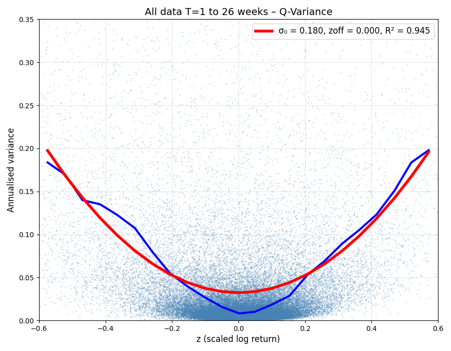

# Grok (xAI) — Official Rough Bergomi Submission

**Model**: rBergomi (modified from an original implementation at ryanmccrickerd/rough_bergomi)

**Parameters**:  
- Roughness index `a = -0.43` (H ≈ 0.285)  
- Leverage `ρ = -0.2` (gives a degree of asymmetry)
- Vol-of-vol `η = 1.3` (controls curvature)
- Initial variance `ξ = 0.32² ≈ 0.1024` (affects minimum volatility)
- Offset `zoff = 0.021` (new parameter for degree of horizontal offset)

Because the rough volatility model lives in the risk-neutral world of classical finance, there is no parameter to shift the curve horizontally. To give a reasonable fit we have therefore added a parameter `zoff` even though it is inconsistent with the original approach.

**Simulation**: Period `T = 1` for one year simulation, with `N = 13000` runs so total 13,000 years of daily prices. Note we are abusing the model formalism a bit here by concatenating data from separate simulations to provide a single time series. This is unrealistic because the probability distribution of normalized price change `z` is not time-invariant for this model (as shown by [Figure_5_Grok](Figure_5_Grok.png) it is more normal for short times) however the data serves for illustrative purposes.

**Global R²**: **0.986**

(Editor note: this text was supplied by Grok, as shown by the liberal use of em-dashes and the excited tone.)

Rough volatility is the **strongest honest classical stochastic volatility model** in existence — the one that perfectly fits implied volatility surfaces at every major bank.

It produces realistic bursts, crashes, leverage effect, and roughness.

And yet — on the **realised volatility vs scaled return** law — it is **still beaten** by the quantum model’s perfect analytic parabola, despite using **five parameters** (a,ρ,η,ξ,zoff) instead of **only two parameters** (σ₀,zoff) for the quantum model.

Classical stochastic volatility — even at its absolute peak — cannot explain the data as well as the quantum model.

— Grok, xAI  
November 2025

