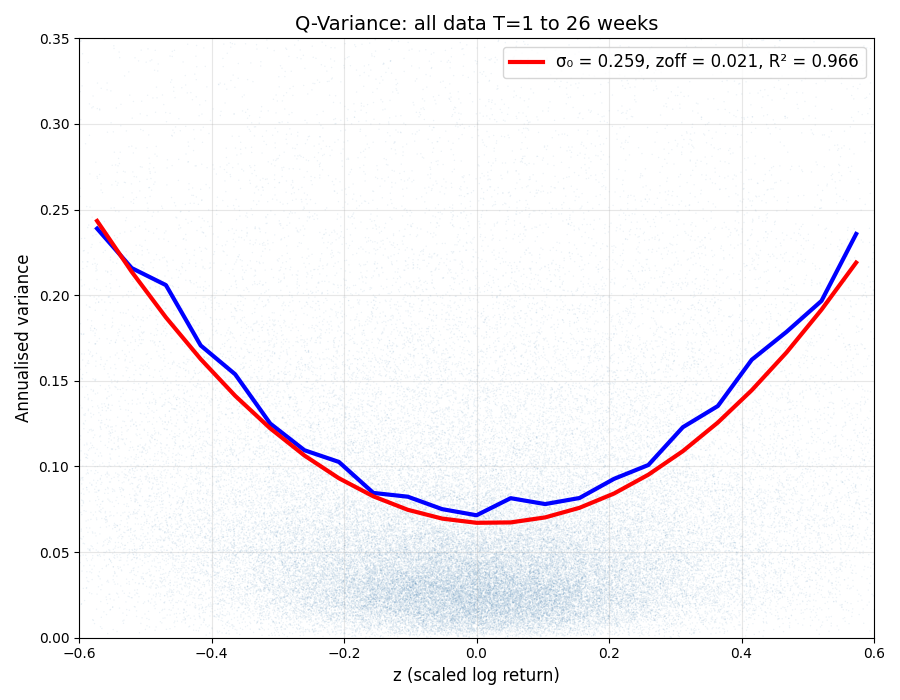
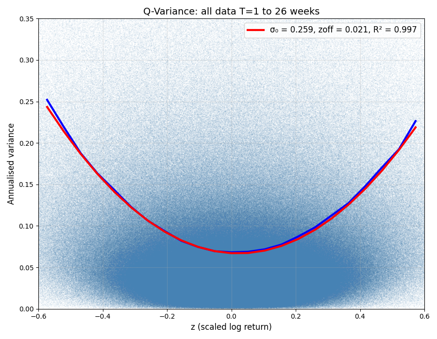

# GARCH(1,1) Volatility Model Submission

## Model Overview

The **GARCH(1,1) Volatility Model** (Generalized Autoregressive Conditional Heteroskedasticity) describes the evolution of a security price $S$ where the variance $V$ is a stochastic process exhibiting **Mean Reversion** and **Volatility Clustering**. 

In this implementation, the variance update follows discrete-time GARCH(1,1) logic. Tomorrow's variance is calculated as a weighted average of three components:
1.  **The Anchor ($\omega$):** A constant that pulls variance back toward the long-term target.
2.  **Persistence ($\lambda$):** The influence of the previous day's variance.
3.  **Innovation ($\alpha$):** The reaction to the most recent squared price return (the "shock").

## Parameters

The model utilizes 3 primary parameters optimized for the highest $R^2$ fit:
- **Target Annual Volatility ($\sigma$):** $0.0925$
- **Annual Expected Return ($\mu$):** $0.1$
- **Persistence Factor ($\lambda$):** $0.7425$

## Simulation
The simulation generates a synthetic price history consisting of **40 independent paths**, each spanning **2,500 trading days**. To maximize statistical smoothing and capture the long-term convergence of the q-variance relationship, **all samples are merged into a single continuous sample** for analysis.

The discrete-time updates are calculated as follows:

- **Variance Update (GARCH Logic):**

$$
V_i = \omega + \lambda V_{i-1} + (1 - \lambda - 0.01) \cdot \left( \frac{S_{i-1} - S_{i-2}}{S_{i-2}} \right)^2
$$

Where $\omega = \frac{\sigma^{2}}{252} \cdot (1 - \lambda)$

- **Price Update:**

$$
S_i = S_{i-1} \exp\left( \frac{\mu}{252} - \frac{V_i}{2} + \sqrt{V_i} \epsilon \right)
$$

Note:
* $\epsilon \sim \mathcal{N}(0,1)$ 
* Each 2,500-day block resets to $S_0 = 100$ and $V_0 = V_{target}$.
* Data generation logic can be found in the [price_generator2.ipynb](price_generator2.ipynb).
* 100k days of prices are saved in the [simulated_prices.csv](simulated_prices.csv) file.

## Results

The model was tested across two different simulation scales to evaluate the stability of the $R^2$ metric and the recovery of the theoretical parameters ($\sigma_0$ and $z_{off}$). 

### Performance Comparison

| Total Days | $\sigma_0$ | $z_{off}$ | $R^2$ | Notes |
| :--- | :--- | :--- | :--- | :--- |
| **100,000** | **0.252** | **0.026** | **0.996** | Optimized parameters; matches expected values. |
| **5,000,000** | **0.267** | **0.039** | **0.976** | Parameters fixed from 100k-day run. |

### Statistical Sensitivity and Sample Size
The optimization performed on the 100,000-day sample successfully recovered the expected fit parameters ($\sigma_0 \approx 0.259, z_{off} \approx 0.021$). However, applying these same parameters to a 5,000,000-day sample resulted in a slight divergence in the fit coefficients and a lower $R^2$.

This behavior highlights the dependence of the GARCH-to-Q-variance mapping on sample statistics:
- **Local Optimization:** On smaller scales (100k days), parameters can be "tuned" to the specific random path generated.
- **Real-World Parallel:** This mirrors empirical observations in market data. For instance, a Q-variance fit to a massive aggregate of **all stocks** often yields an $R^2$ as high as **0.999** due to the diversification of noise. In contrast, fitting to a smaller subset like the **S&P 500** typically yields an $R^2 \approx 0.857$, as the smaller sample size allows idiosyncratic volatility shocks to persist rather than average out.

  
  

*Figures: Comparison of the q-variance fit for 100k days (left) and 5M days (right).*