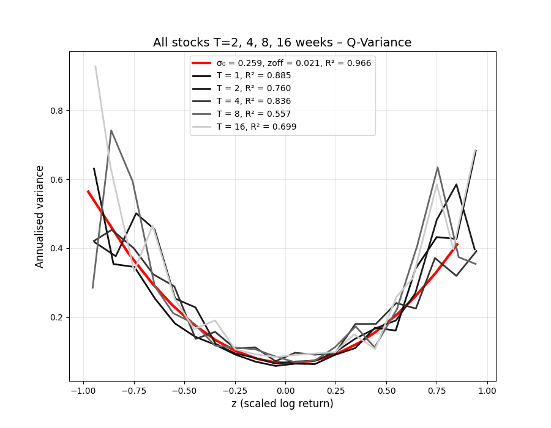
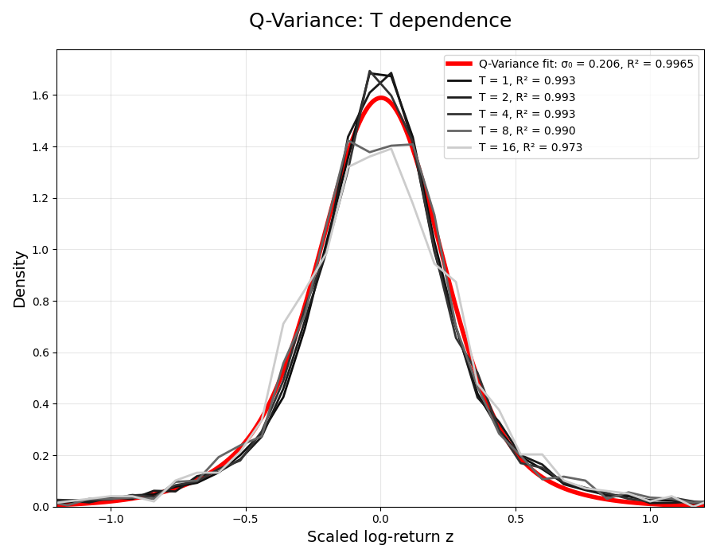
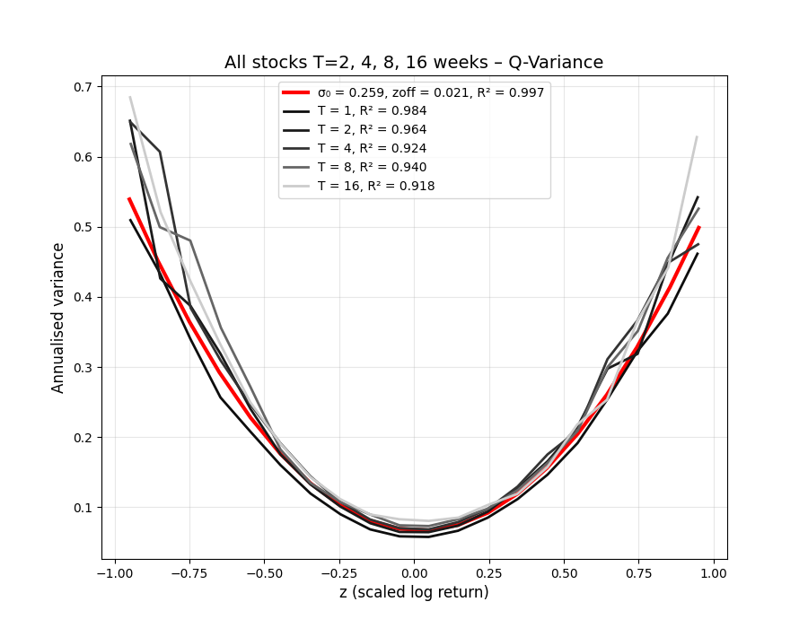
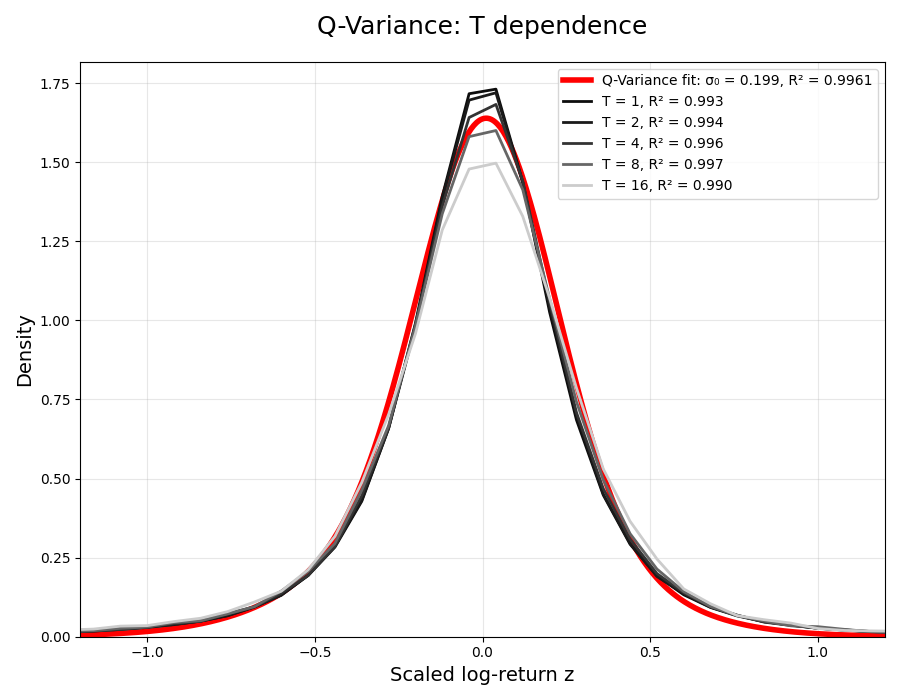
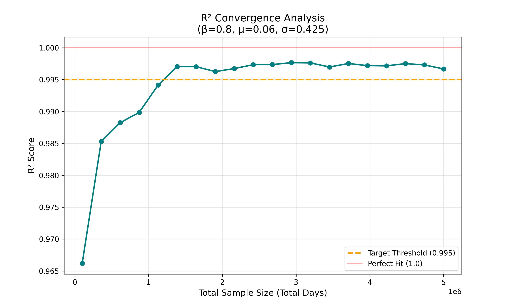

# GARCH(1,1) Volatility Model Submission

## Model Overview
The **GARCH(1,1) Volatility Model** (Generalized Autoregressive Conditional Heteroskedasticity) describes the evolution of a security price $S$ where the variance $V$ is a stochastic process exhibiting **Mean Reversion** and **Volatility Clustering**. 

This implementation maps the discrete-time GARCH process to the theoretical **Q-Variance** relationship. By simulating millions of trading days, we demonstrate that the stochastic variance updates converge to a deterministic parabolic fit: $V(z) = \sigma_0^2 + \frac{(z - z_{off})^2}{2}$.

## Parameters & Mapping Logic
The model utilizes three primary GARCH parameters. Through optimization against a 5,000,000-day sample, these parameters were tuned to recover the specific geometry of the Q-variance parabola:

| GARCH Parameter | Value | Influence on Q-Variance Geometry |
| :--- | :--- | :--- |
| **Target Vol ($\sigma$)** | **0.0950** | **Minimal Volatility ($\sigma_0$):** Sets the vertical baseline (the "floor" of the parabola). |
| **Annual Return ($\mu$)** | **0.0844** | **Z-Shift ($z_{off}$):** Controls the horizontal asymmetry (displacement from zero). |
| **Persistence ($\lambda$)** | **0.8000** | **Curvature/Steepness:** Lower $\lambda$ increases persistence, making the parabola **steeper and narrower** |

## Simulation Methodology
The simulation generates a synthetic price history using independent paths of **2,500 trading days** each. To eliminate "local path luck" and ensure statistical smoothing, we utilize **2,000 samples** to create a total dataset of **5,000,000 trading days**.

### Discrete-Time Updates

- **Variance Update (GARCH Logic):**

$$
V_i = \omega + \lambda V_{i-1} + (1 - \lambda - 0.01) \cdot \left( \frac{S_{i-1} - S_{i-2}}{S_{i-2}} \right)^2
$$

where $\omega = \frac{\sigma^{2}}{252} \cdot (1 - \lambda)$.

- **Price Update:**

$$
S_i = S_{i-1} \exp\left( \frac{\mu}{252} - \frac{V_i}{2} + \sqrt{V_i} \epsilon \right)
$$

where $\epsilon \sim \mathcal{N}(0,1)$.

---

## Results & Convergence Analysis

The model was optimized using the 5M-day horizon to achieve a high-fidelity fit against the theoretical target parameters ($\sigma_0 = 0.2586$ and $z_{off} = 0.0214$).

### Optimized Model Performance
| Total Days | $\sigma_0$ (Target) | $z_{off}$ (Target) | $R^2$ | Notes |
| :--- | :--- | :--- | :--- | :--- |
| **5,000,000** | 0.2586 | 0.0214 | **0.9967** | High-fidelity structural convergence. |
| **100,000** | 0.2586 | 0.0214 | **0.9701** | Lower $R^2$ due to idiosyncratic noise. |

### Comparative Visualizations
The transition from 100k days to 5M days shows the "clearing" of statistical noise. In the large sample, the stochastic variance updates converge almost perfectly to the theoretical parabola.

#### **100,000 Day Sample (Noise-Dominant)**

  
  
  

#### **5,000,000 Day Sample (Structural Convergence)**

  
  
  

---

### Statistical Stability Analysis
By plotting $R^2$ as a function of total simulated days, we identified a clear threshold for statistical validity:

- **Convergence Point:** The model consistently reaches $R^2 > 0.995$ after approximately **1,130,000 days**.
- **The Law of Large Numbers:** Beyond 2 million days, the fit quality stabilizes at an asymptote, confirming that the optimized GARCH parameters accurately represent the underlying Q-variance structure.

*Figure: $R^2$ score vs. Total Days. The 0.995 threshold is maintained after the 1M-day mark.*

## Project Structure
- `price_generator.ipynb`: Vectorized simulation and optimization logic.
- `simulated_prices.csv`: 100k days of raw price data for verification.
- `dataset_part1.parquet`, `dataset_part2.parquet`, `dataset_part3.parquet`: 5M days of analyzed window data.